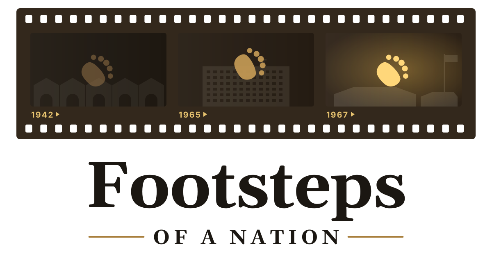

<p align="center">
  <picture>
    <source media="(prefers-color-scheme: dark)" srcset="public/assets/logo/logo.svg" />
    
  </picture>
</p>

# Footsteps of a Nation: A Singapore Story

A Three.js browser game: Sparky the plush bear steps through an old box camera into three days that
shaped Singapore — 1942, 1965 and 1967. Plays on desktop (keyboard/mouse or gamepad) and phones
(touch, landscape). Chapter 1 (February 1942) and Chapter 2 (9 August 1965) are playable; chapter 3 is planned
(see [docs/design.md](docs/design.md), [docs/ch2-script.md](docs/ch2-script.md)).

## Run

```bash
npm install
npm run dev      # http://localhost:5173 (also on your LAN for phone testing)
npm run build    # static build in dist/ — host anywhere (itch.io, GitHub Pages, …)
```

## Controls

| Desktop | Phone |
| --- | --- |
| WASD / arrows move, Shift run, mouse look (click to lock) | Left thumb: move · drag right side: look |
| E talk / use · Space snap photo / continue | Gold button: talk / use · Run toggle |
| J album · R recentre · Esc pause · gamepad supported | Camera icon: album · double-tap: recentre |

Settings (pause menu): graphics tier (Low / Medium / High), volume, music, sound captions,
reduced camera shake & flashes, invert Y.

## Debug URL flags

- `?beat=papers|raid|shelter|blackout|rumours|epilogue` — jump to a beat after pressing Begin.
- `?chapter=ind` — open on Chapter 2 (1965); with `&beat=morning|ten|errand|worries|evening|tv|wall` to jump.
- `?stats` — FPS / draw calls / triangles overlay.
- `?test` — keep simulating in a hidden tab (automated playtests).

## Project layout

- `src/engine/` — renderer (pmndrs postprocessing, quality tiers, adaptive resolution), input
  (keyboard/mouse/touch via nipplejs/gamepad), third-person camera, characters, collision
  (three-mesh-bvh), audio (Howler), UI, photo album, effects, newspaper puzzle.
- `src/chapters/` — chapter scripts and text (`ww2-text.js` holds all Chapter 1 writing + sources; `ind-*.js` is
  Chapter 2: `ind-text.js` writing + sources, `ind-kopi.js` kopi orders, `ind-tv.js` the archival TV, `ind-decals.js`
  runtime signage; `chapter-kit.js` shared helpers).
- `public/assets/` — models (Blender-built, meshopt-compressed, desktop + `-mobile` variants),
  audio (with licences in `audio/README.md`), fonts (OFL), and `logo/`: the film-strip logo (`logo.svg` for dark
  backgrounds, `logo-light.svg`, `logo-strip.svg`), app icons, favicon and `social-preview.png`. Text in the logo
  files is outlined; the title screen rebuilds the logo inline in `index.html`.
- `tools/` — reproducible Blender / audio build scripts (Chapter 2: `build_kopitiam.py` set, `build_1965_npcs.py` cast,
  `build_sparky_1965.py` + `OUTFITS=ind tools/optimize_sparky.sh` Sparky's 1965 outfit).
- `docs/research/` — historical, architectural and costume research with sources.
